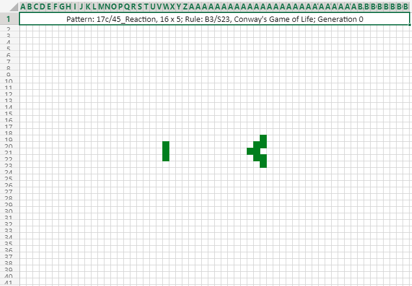
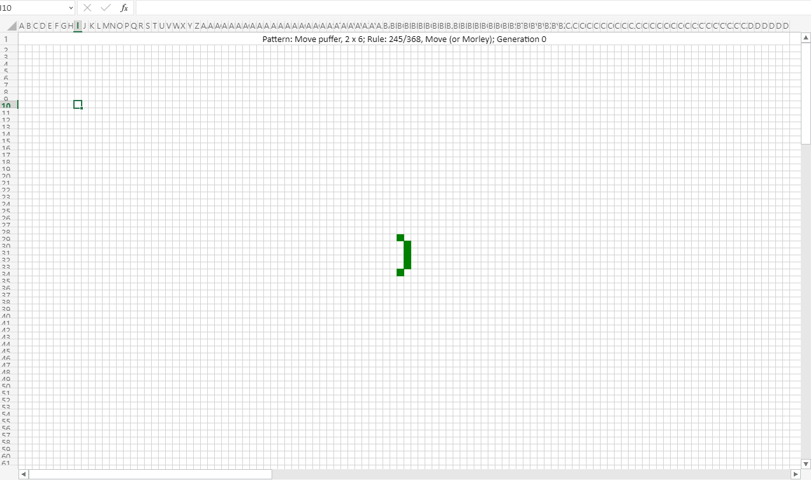

# Conway's Game of Life in Office Scripts

This is a ["Conway's Game of Life"](https://en.wikipedia.org/wiki/Conway%27s_Game_of_Life) simulator written in [Office Scripts](https://aka.ms/office-scripts) that can demonstrate this classic yet interesting game on Excel worksheet.

## Background

### Conway's Game of Life

Please refer to <https://en.wikipedia.org/wiki/Conway%27s_Game_of_Life> for more details about this wonderful game.

> The Game of Life, also known simply as Life, is a cellular automaton devised by the British mathematician John Horton Conway in 1970. It is a zero-player game, meaning that its evolution is determined by its initial state, requiring no further input. One interacts with the Game of Life by creating an initial configuration and observing how it evolves. It is Turing complete and can simulate a universal constructor or any other Turing machine.

### Office Scripts

Please refer to <https://aka.ms/office-scripts> for more details about Office Scripts in Excel on the web.

> Office Scripts in Excel on the web let you automate your day-to-day tasks. You can record your Excel actions with the Action Recorder, which creates a script. You can also create and edit scripts with the Code Editor. Your scripts can then be shared across your organization so your coworkers can also automate their workflows.

## Usage

- Firstly start from [here](https://aka.ms/office-scripts) to get familiar with Office Scripts in Excel on the web.

- Add a new script in the Office Scripts code editor and replace its content with [game-of-life.ts](src/game-of-life.ts)
  
- Follow the comments in the code to customize what and how you want to render.
  - The dimension of the game board
  - The dimension of each cell
  - The cell color
  - The maximum generations you want it to run
  - The initial pattern's rule
- Hit the `▶ Run` button above the code editor.
- The rendering might take a while so take your time.

## Supported rules

- [Conway's Game of Life (23/3)](https://www.conwaylife.com/wiki/Conway%27s_Game_of_Life) (the most common rule)
- [HighLife (23/36)](https://www.conwaylife.com/wiki/OCA:HighLife)
- [Life without death ( 012345678/3)](https://www.conwaylife.com/wiki/OCA:Life_without_death)
- [Maze (12345/3)](https://www.conwaylife.com/wiki/OCA:Maze)
- [2x2 (125/36)](https://www.conwaylife.com/wiki/OCA:2%C3%972)
- [Move (245/368)](https://www.conwaylife.com/wiki/OCA:Move)
- B3578/S238

## Samples

Here are a few interesting samples based on the rules from <https://copy.sh/life/examples>. Please note the frame rates of the screen recordings here are adjusted for demonstration. The actual game speed is much slower.

- Bi-clock, 7x7:
  

- Maze wickstretcher, 6x8:
  

- 2x2 Block Oscillators, 26x2:
  

- Baker, 16x14:
  

- Bomber Predecessor, 10x6:
  

- B3578/S238 Replicator, 7x7:
  

- Move puffer, 2x6:
  

## Note

- Rendering a game with many cells sometimes might be unstable. If you see the rendering has stopped, you may need to pick a different pattern with less cells.
- Unfortunately this simulator code doesn't work with the ["Run script" action in Power Automate](https://docs.microsoft.com/en-us/office/dev/scripts/tutorials/excel-power-automate-manual), yet.
