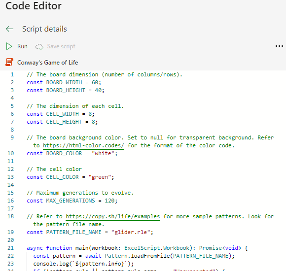
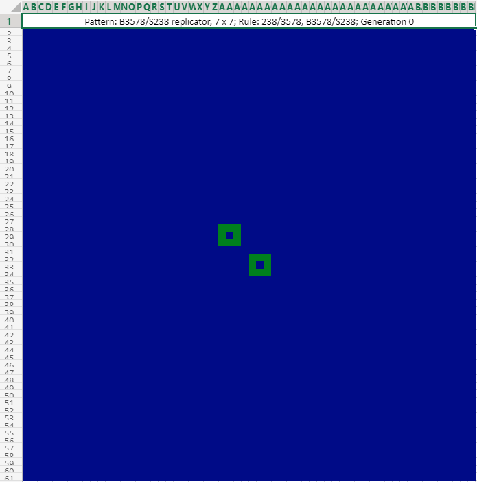

# Conway's Game of Life in Office Scripts

This is a Game of Life simulator in [Office Scripts](https://aka.ms/office-scripts) that can demonstrate this classic yet fascinating game on Excel worksheet.


*17c/45_Reaction, 16x5 (`17c45reaction.rle`)*

## Background

### Conway's Game of Life

Please read <https://en.wikipedia.org/wiki/Conway%27s_Game_of_Life> for more details about this wonderful game.

> The Game of Life, also known simply as Life, is a cellular automaton devised by the British mathematician John Horton Conway in 1970. It is a zero-player game, meaning that its evolution is determined by its initial state, requiring no further input. One interacts with the Game of Life by creating an initial configuration and observing how it evolves. It is Turing complete and can simulate a universal constructor or any other Turing machine.

### Office Scripts

Please refer to <https://aka.ms/office-scripts> for more details about Office Scripts in Excel on the web.

> Office Scripts in Excel on the web let you automate your day-to-day tasks. You can record your Excel actions with the Action Recorder, which creates a script. You can also create and edit scripts with the Code Editor. Your scripts can then be shared across your organization so your coworkers can also automate their workflows.

## Usage

- Firstly start from [here](https://aka.ms/office-scripts) to get familiar with Office Scripts in Excel on the web.

- Create a new workbook in Excel on the Web.

- Open the **Automate** tab.

- Press the **New script** button.

- Copy the code from [game-of-life.ts](https://raw.githubusercontent.com/yutao-huang/office-scripts-conway-game-of-life/master/src/game-of-life.ts) and paste into the Code Editor:

  

- Optionally, rename the script as "Conway's Game of Life".
- Hit the `▶ Run` button above the code editor.
- After a few seconds of churning (downloading the pattern rule and setting up the game board), a small ["glider"](https://www.conwaylife.com/wiki/Glider) will come to life and start to travel across the worksheet. Please note it will take a bit longer to run for the very first time.

  

## Customize the game

Follow the comments in the code to customize what and how you want to render the game. Most of the default settings should just work fine but please feel free to explore different game patterns.

- The dimension of the game board (number of columns/rows):

  ```typescript
  const BOARD_WIDTH = 60;
  const BOARD_HEIGHT = 40;
  ```

- The dimension of each cell (in pixels):

  ```typescript
  const CELL_WIDTH = 8;
  const CELL_HEIGHT = 8;
  ```

- The board background color (refer to <https://html-color.codes/> for the format of the color code):

  ```typescript
  const BOARD_COLOR = "white";
  ```

  Or use `null` for a transparent board:

  ```typescript
  const BOARD_COLOR = null;
  ```

- The cell color (refer to <https://html-color.codes/> for the format of the color code):

  ```typescript
  const CELL_COLOR = "green";
  ```

- The maximum generations you want it to run:

  ```typescript
  const MAX_GENERATIONS = 120;
  ```

- The initial pattern's rule (refer to <https://copy.sh/life/examples> for more sample patterns - look for the pattern file name):

  ```typescript
  const PATTERN_FILE_NAME = "glider.rle";
  ```

## Supported rules

- [Conway's Game of Life (23/3)](https://www.conwaylife.com/wiki/Conway%27s_Game_of_Life) (the most common rule)
- [HighLife (23/36)](https://www.conwaylife.com/wiki/OCA:HighLife)
- [Life without death (012345678/3)](https://www.conwaylife.com/wiki/OCA:Life_without_death)
- [Maze (12345/3)](https://www.conwaylife.com/wiki/OCA:Maze)
- [2x2 (125/36)](https://www.conwaylife.com/wiki/OCA:2%C3%972)
- [Move (245/368)](https://www.conwaylife.com/wiki/OCA:Move)
- B3578/S238

## Samples

Here are a few interesting samples based on the rules from <https://copy.sh/life/examples>. Note the frame rates have been adjusted for the screen recordings here for demonstration purpose. The actual evolution rendered in Excel on the Web is slower.

- Bi-clock, 7x7 (`biclock.rle`):

  

- Maze wickstretcher, 6x8 (`mazewickstretcher.rle`):

  

- 2x2 Block Oscillators, 26x2 (`2x2blockoscillators.rle`):

  

- Baker, 16x14 (`baker.rle`):

  

- Bomber Predecessor, 10x6 (`bomberpredecessor.rle`):

  

- B3578/S238 Replicator, 7x7 (`b3578s238replicator.rle`):

  

## Note

- Rendering a game with many cells sometimes might be unstable. If you see the rendering has stopped, you may need to pick a different pattern with less cells.
- Unfortunately this simulator code doesn't work with the ["Run script" action in Power Automate](https://docs.microsoft.com/en-us/office/dev/scripts/tutorials/excel-power-automate-manual), yet.

## References

- [Office Scripts in Excel on the web](https://docs.microsoft.com/en-us/office/dev/scripts/overview/excel)
- [LifeWiki](https://www.conwaylife.com/wiki/Main_Page) - The wiki for Conway's Game of Life.
- <https://copy.sh/life> - Please do check out this awesome web-based implementation of Conway's Game of Life!
